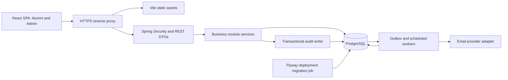

# Architecture

Status: architecture aligned with the [accepted decisions](decisions.md). M1A technical foundation and M1B local authentication/security are implemented. [M1B security](m1b-security.md) records exact runtime behavior and production blockers; registration/reset, full MFA, notifications and business behavior below remain the target. Preserve the existing modular monolith and engineering safeguards. [Roadmap](roadmap.md) describes future delivery; unresolved institutional policy details do not reopen accepted choices.

## System shape

Use a monorepo with a **modular monolith**: one React SPA, one Spring Boot deployable and one PostgreSQL database. Alumni and Admin have separate route trees and layouts, but share accessible UI primitives and API infrastructure. Domain modules share a deployment and local transactions while keeping explicit ownership boundaries.

Use one public origin: `/` serves the frontend and `/api/v1` reaches the backend. PostgreSQL is private. Development uses the Vite proxy for API calls. A same-origin deployment simplifies cookies and CORS. Keep Docker and Docker Compose as the local/deployment foundation and remain cloud/provider neutral. Do not introduce microservices or Kubernetes; no broker, Redis or object store is required for MVP.

M1A root `compose.yaml` runs PostgreSQL only; frontend and backend run on the host. Later Docker Compose deployment work will add frontend, backend and one-shot migrator services, with development build/proxy settings and a mock/log email sender or local mail sink. Deployment uses built images and environment-specific configuration/secrets. Production host, email transport and recovery ownership are institutional inputs I-04; no vendor is selected. A development Compose configuration alone is not a complete production operations plan.

## Technology and build decisions

The user-specified stack is mandatory. M1A selects Maven Wrapper, npm with a lockfile and `openapi-typescript` for transport types; Spring Session JDBC is the implemented M1B session store. The [verified version matrix](m1a-verification.md) pins Java 21, Spring Boot 3.5, JUnit 5, Testcontainers 2, React 19, TypeScript 5.9 and Node 24. Verified security/session versions are recorded in the M1B security document; full MFA remains deferred.

The reviewed contract is [contracts/openapi/mezun360.yaml](../contracts/openapi/mezun360.yaml); it contains implemented health, authentication, security probes and error schemas. DTOs/controllers implement it; integration tests compare generated paths, response statuses and schema fields/types/required properties, while frontend CI checks generated type drift. Extend these checks with each new operation. A small hand-written fetch transport uses generated schema types. Do not hand-edit generated output or expose JPA models as schemas.

## Backend module boundaries

Base package proposed: `tr.edu.btu.mezun360`. Use one Maven module initially, organized by business capability. Each capability owns `api`, `application`, `domain`, and `infrastructure` packages as needed; avoid empty abstractions. Application service classes own use cases, validation of business rules, authorization and transactions. Domain types may encapsulate invariants but controllers contain no business logic.

| Module | Owns | Allowed collaboration |
| --- | --- | --- |
| `identity` | Accounts, local credentials, roles, sessions, email verification/reset and staff MFA policy | Authentication port normalizes identity proof; future SSO adapter does not alter domain authority |
| `alumni` | Professional/private profiles, education, experience, `PENDING`/`VERIFIED`/`REJECTED` verification and visibility | Uses identity policy; exposes eligibility/DTOs and an institutional-verification port; manual ADMIN decisions in MVP |
| `careers` | Organizations, jobs with application mode, saved jobs, external application handoff | Uses alumni eligibility; internal application workflow is a future extension in this module |
| `mentoring` | Mentor opt-in/moderation, structured requests and standard/quick sessions | Uses alumni eligibility/DTOs; one lifecycle for REQUESTED through terminal outcomes |
| `events` | Capacity, registration, cancellation and attendance | Uses alumni eligibility; owns a future waitlist extension seam without MVP queue processing |
| `content` | Selected university announcements/news, publication lifecycle and public projection | Staff controls publication; no dependency on private alumni repositories or public analytics |
| `notifications` | In-app notifications, channel preferences, delivery attempts/templates | Consumes domain events; accesses recipient address through restricted identity/alumni contracts |
| `reporting` | Authorized metric definitions and aggregate read models | Uses published read contracts or documented aggregate SQL views; never writes another module's tables |
| `privacy` | Privacy requests and approved erasure/export orchestration | Invokes each data-owning module's privacy service; no repository shortcuts |
| `audit` | Append-only security/business audit records and protected audit reads | Accepts sanitized events from all modules |
| `automation` | Outbox dispatch, durable reminders, leases/retries and operational jobs | Calls application services with a restricted system actor |
| `shared` | Problem response, clock, IDs, pagination and event envelopes | No alumni/career business rules; no general-purpose dumping ground |

Dependency direction: HTTP adapter → application service → domain/persistence ports → infrastructure. Repository interfaces may use Spring Data JPA within their own module. Only the module's application/public contracts are imported by other modules; repositories and entities stay internal. Avoid cycles: publish events for reverse notifications; do not make identity depend on careers/events. Document reporting views as explicit, versioned read-only exceptions.

Transactions are local PostgreSQL transactions started by services. Write business state, audit record and outbox event atomically. External email/provider calls happen after commit. Use optimistic locking for normal edits and targeted row locks/unique constraints for contested operations. Disable Open Session in View; map DTOs inside a controlled query/transaction.

## Frontend boundaries

- `app/` owns bootstrap, providers and React Router configuration; `layouts/` owns shells and `routes/paths.ts` catalogs future destinations. The explicit M1A request settles public/auth, `/app/*` for alumni and `/admin/*`, superseding the earlier `/alumni/*` proposal. Registered routes include `/login`, informational `/forgot-password`, guarded `/app` and `/admin` placeholders, the root, development-only `/__dev/foundation` and not-found view. Business dashboards remain deferred.
- `features/` mirrors user capabilities; each feature owns its API hooks, screens, forms, schemas, components and relevant Vitest tests. Staff pages compose these features under a staff layout rather than duplicating the entire frontend.
- `components/ui/` holds shadcn/ui primitives; shared composites go in `components/`. Tailwind tokens use the user-specified colors/Barlow font. Shared primitives follow shadcn/ui composition with Radix Dialog/Slot. Spacing/radius choices are provisional engineering defaults, recorded in the [design evidence](design/m1a-foundation.md).
- TanStack Query owns remote state and cache invalidation. Router/search parameters own navigable filters. Local React state owns temporary UI/form state. Do not introduce a global state library without a demonstrated need.
- Recharts consumes typed, authorized aggregate DTOs. It never computes staff metrics from downloading private alumni records. Include accessible table/text alternatives and empty/suppressed/error states.
- Client route guards use the current session response for UX. Every API request still passes server authorization. Abort outstanding private requests and clear the query cache on logout, session expiry and identity change; scope query keys by actor where appropriate.
- Keep error codes stable and localize display messages. Frontend validation improves feedback; it never replaces backend Bean Validation or service checks.

## Authentication flow — accepted local-identity baseline (D-02)

MVP uses local email/password authentication, adaptive password hashing and secure HttpOnly cookie-based server sessions. BTÜ SSO is a future adapter only; do not implement it now. e-Devlet is future roadmap only. Business services depend on the internal account/current-actor contract, never on local password or university-specific claims.

1. Browser requests `GET /api/v1/auth/csrf`. The server creates/uses a session and returns a CSRF token with `Cache-Control: no-store`. Keep it in memory and send `X-CSRF-TOKEN` on every unsafe request, including registration, login, logout and password reset. Use Spring Security's supported SPA handling for the selected version; refresh after login/logout. See [Spring Security CSRF documentation](https://docs.spring.io/spring-security/reference/servlet/exploits/csrf.html).
2. Future registration accepts only name, email, password and required notice acknowledgments. The service assigns `ALUMNI` and `PENDING_EMAIL`; the request cannot select authority. Normalize email consistently and enforce uniqueness. Return a generic accepted response for new/existing addresses, with rate limiting, to reduce account enumeration.
3. Future email verification sends a short-lived email verification link. Store a token digest, purpose, account, expiry and consumed timestamp. GET opens a confirmation page; it must not consume the token because email scanners may follow links. POST with token and CSRF consumes it atomically. Active accounts still require separate alumni status `VERIFIED` through ADMIN review.
4. Login validates the password with Spring Security's adaptive password encoder. Implemented algorithm: Argon2id with parameters documented in M1B security; production concurrency benchmarking remains required; use a delegating format for future upgrades. No reversible password storage. See [Spring password storage](https://docs.spring.io/spring-security/reference/features/authentication/password-storage.html) and [OWASP guidance](https://cheatsheetseries.owasp.org/cheatsheets/Password_Storage_Cheat_Sheet.html).
5. Completed authentication rotates the session ID and persists a minimal principal/security context. ADMIN password success alone creates only a restricted pre-MFA context; issue application authorities only after the second factor succeeds, except in explicit local development with MFA disabled. Production cookie: `__Host-mezun360-session`, `Secure`, `HttpOnly`, `SameSite=Lax`, `Path=/`, no `Domain`. Local HTTP development has separate cookie configuration. No bearer JWT or refresh token in browser storage.
6. Store sessions in PostgreSQL with Spring Session JDBC. Add its dependency explicitly; own the library's selected-version session schema through Flyway and disable automatic schema initialization. Store only required authentication data, not complete profile objects. See [Spring Session JDBC](https://docs.spring.io/spring-session/reference/configuration/jdbc.html).
7. `GET /auth/me` returns safe own-account identity, role, account status, MFA assurance and absolute expiry after authentication; anonymous callers receive 401. Alumni verification/onboarding remains M2. Authorization resolves current account state/authority from the database for each protected request so a stale session cannot retain revoked privileges. Services recheck eligibility for sensitive mutations within the transaction.
8. Implemented configurable session defaults: alumni 30-minute idle / 8-hour absolute; staff 15-minute idle / 4-hour absolute. These are technical security defaults, not legal retention periods. Enforce both server-side. Logout revokes the session and clears the cookie. Password reset, suspension, deactivation and authority changes revoke all affected sessions.
9. Future password-reset requests always receive a generic response. Reset tokens are cryptographically random, purpose-bound, expiring and single-use. Updating the password and consuming all outstanding reset tokens is atomic. Notify the account holder without including the new password. Do not silently log the user in after reset.

Authentication link landing pages must have no third-party analytics, use a restrictive referrer policy, and remove link secrets from the visible URL/history after reading them into memory. Access logs must redact tokens. Verification/reset never restore a suspended or deactivated account; account-state transitions remain a separate authorized workflow.

Rate-limit registration, login, token requests and sensitive lookup using both account-safe keys and source limits. In a multi-instance deployment the limiter must have shared enforcement (edge or database), not per-process counters alone. Avoid permanent account locks that enable denial of service.

ADMIN MFA is mandatory in production with local authentication; M1B supplies a fail-closed boundary; separately authorized work must add the real TOTP library/adapter and recovery flow before production. An explicit local-development configuration may disable MFA; production startup/deployment validation must fail if disabled or a mock MFA adapter is selected. Never let a request header or user field toggle it. Staff provisioning must not bypass enrollment. A restricted enrollment/challenge context has no normal admin privileges; recovery cannot grant a permanent bypass. Institutional enrollment/recovery/break-glass policy is I-01. Preserve CSRF and server authorization in every environment.

## Future integration boundaries

Inside `identity`, an `AuthenticationProvider`/authenticator boundary validates credentials and returns normalized subject and assurance information. The M1B local adapter uses Spring Security password verification and a fail-closed MFA boundary; the real factor implementation is deferred. Session issuance resolves the stable internal `UserAccount` ID and current server-owned role. A future BTÜ SSO adapter can add protocol endpoints and link `(provider, issuer, subject)` to that account without changing business modules, API ownership rules or frontend member sessions. Never auto-link by an untrusted email or accept ADMIN from arbitrary claims; linking requires proof and a reviewed staff policy. No SSO credentials, callback routes or identity-link tables are created merely to reserve this seam. e-Devlet has no MVP connector or authentication path.

Inside `alumni`, `InstitutionalAlumniVerificationPort` accepts a minimal evidence request and returns normalized `PENDING`/`VERIFIED`/`REJECTED`, source/reference, checked time and safe reason. It cannot write repositories, roles or profiles. The application service owns state transitions, reviewer authority, audit and access invalidation; MVP uses the manual ADMIN review path without external calls. A future BTÜ OBS adapter supplies institutional evidence under the same service rules, with an explicit policy for conflicting/manual decisions. Availability failures preserve pending work instead of asserting verification or rejection. Do not implement OBS, polling or imports now.

## Domain extension boundaries

- `JobPosting.applicationMode` supports `EXTERNAL_APPLICATION` and `INTERNAL_APPLICATION`. MVP creates/publishes external jobs with a validated HTTPS destination; unsupported internal activation is rejected. A server-authorized handoff resolves the stored destination, never a client-provided redirect URL. Do not forward account/contact data or create an application record. Internal submission/review later belongs to `careers`, not a new service; its tables/routes/metrics stay deferred.
- Alumni control `PRIVATE`/`ALUMNI_MEMBERS` visibility and a separate default-false future employer preference. Effective employer access is always denied in MVP. Mentor opt-in exposes only a mentor-card projection. Staff protected-data access requires purpose and successful audit append.
- `MentorshipRequest` contains topic, message, preferred meeting method/time, server-managed status and `sessionType` (`STANDARD`/`QUICK`). Hızlı Mentörlük uses `QUICK`, with the reviewed design's configurable 20-minute duration default. Use one service, table, permissions and state machine; no separate fast-mentoring subsystem or automatic contact disclosure. Relative time preferences resolve to a dated UTC window plus `Europe/Istanbul` context; preference is not a confirmed appointment.
- `EventRegistrationService` owns allocation/cancellation and a capacity-policy boundary. MVP returns `EVENT_FULL`; future waitlist entries/promotion would remain inside `events`, take the same event lock and publish notifications through the existing outbox. Do not create a queue table, WAITLISTED state or promotion worker before that scope is authorized.
- `content` publishes selected university announcements/news through explicit staff commands. Anonymous DTOs exclude personal data; only `PUBLISHED` + `PUBLIC` content is readable. Landing/platform information may be approved static frontend content. There are no public job/event/member/analytics endpoints.

## Authorization and admin provisioning

Use deny-by-default HTTP rules plus method-level service checks. Enable method security explicitly; annotations alone are not effective without configuration. Protect `/api/v1/admin/**` with `ADMIN` and current active-account checks; require step-up/recent authentication for sensitive operations as defined in the selected MFA solution. See [Spring method security](https://docs.spring.io/spring-security/reference/servlet/authorization/method-security.html).

Services also enforce object ownership, actor eligibility, permitted state transitions and field-level access. Data queries must apply ownership/publication/visibility filters before pagination. Public, peer, owner and staff DTOs are distinct. Use explicit predicates instead of enum ordering or an implicit role hierarchy. Admin access to data does not grant the right to act as an alumni participant.

No MVP endpoint, profile payload or registration field grants/revokes roles. Initial and subsequent staff accounts are provisioned through a restricted operator runbook/application command using an approved university staff roster and recorded authorization. The command must refuse self-role changes, refuse ordinary client execution, and record operator identity, approver, target, reason and outcome. A bootstrap operator is a deployment operator, not a user-facing `SUPER_ADMIN` role. Bootstrap is one-time and disabled after setup; passwords never appear in code, Flyway seed data or command-line arguments. Changes revoke existing target sessions. Operational user changes are audited service operations, not schema migrations.

Staff must not review their own eligibility/privacy case. Protect the last usable administrator from accidental deactivation unless an approved recovery procedure is active. A future role-management UI needs a separate reviewed permission model; it is not implied by having `ADMIN` today.

## Notification and automation architecture

Channels are `IN_APP` and `EMAIL`, dispatched through a notification-channel contract with an `EmailSender` port beneath email delivery. Templates, preferences, recipients and retry rules are application-owned; adapters translate to transport-specific requests/results. No commercial SDK type leaks into domain/service contracts. Local development may bind a mock/log sender or mail sink; mock logs contain only synthetic identifiers and sanitized outcome metadata, never passwords, link tokens or private message bodies. Production must reject mock/log bindings and require an explicitly configured real transport; no commercial service is selected now.

1. A business service saves a minimal versioned outbox event inside its transaction, for example `AlumniVerified.v1`, `MentorshipAccepted.v1` or `EventCancelled.v1`. Envelope: event ID, type/version, aggregate ID/version, occurrence time and correlation ID. Payloads contain IDs and approved state, not full profiles or contact snapshots.
2. A worker claims due rows in short transactions using row locks with `SKIP LOCKED` and a lease. It commits the claim before external I/O. Recover expired leases after a crash; use bounded exponential backoff with jitter, maximum attempts and terminal failed state. See [PostgreSQL locking](https://www.postgresql.org/docs/current/explicit-locking.html).
3. Consumers create in-app records and delivery jobs using unique deduplication keys. A job resolves eligibility, current contact destination and notification preferences again before sending. Do not send stale reminders for cancelled events or cancelled/completed mentorships.
4. Scheduled reminders are durable jobs keyed by entity, recipient, reminder type and schedule version. Rescheduling supersedes old jobs. Multiple worker instances cannot own the same live lease; all handlers still tolerate redelivery. Use an injected clock, UTC instants and an explicit display timezone.
5. Separate in-app persistence from the email-provider adapter. Security/account messages and optional opportunity digests have separate preferences. MVP automation is code-defined and limited to verified account emails, workflow updates and event reminders; there is no arbitrary rules engine.
6. Track provider request IDs, attempts, latency and sanitized failure codes. External email is at-least-once: a provider may accept a message before an acknowledgment is lost. Use a stable provider idempotency key where supported; do not promise exactly-once email. In-app notification deduplication is enforced by the database.
7. Verification/reset email delivery needs a short-lived encrypted delivery envelope because the raw link secret cannot be reconstructed from its digest. Store ciphertext separately from the general event payload, with a key held outside the database, a strict TTL and deletion after terminal delivery/expiry. The authentication token table stores only the digest. Never log or expose the envelope; production deployment must supply key management. Business notifications need no secret envelope.
8. Staff see counts and sanitized failed-job details. Controlled retry preserves the original event/deduplication identity and is audited. Never retry poison messages forever or run a destructive cleanup before the retention policy is approved.

Recipient eligibility is purpose-specific: pending-email accounts may receive verification mail, and active unverified alumni may receive account/review updates. Optional member messages require current member eligibility. Authentication deliveries whose secret envelope has expired or been deleted cannot be replayed by staff; a fresh user-initiated verification/reset request issues a new bounded delivery.

## Audit logging

Keep business/security audit records separate from diagnostic logs and notification history. Capture actor ID/type (`USER`, `SYSTEM`, `OPERATOR`), role at time, action, target type/ID, outcome, reason code, UTC timestamp, correlation ID and allowlisted changed field names. Use minimal state transitions rather than whole before/after object dumps.

Audit authentication/MFA outcomes, token abuse, staff provisioning, suspensions, verification decisions, private contact lookups, privacy processing, job/event/content publication, mentorship moderation and job retries. Internal application review audit is future scope with that workflow. Failed authentication uses a pseudonymous account fingerprint only if necessary; never record the attempted password or raw email by default.

For successful changes, audit and business state share a transaction; if audit insertion fails, sensitive changes fail too. Denied attempts use a separate security-event transaction so rollback does not erase them. Sensitive private-data reads require a successful audit append before returning data. Apply rate limits/aggregation to noisy denial telemetry without dropping required staff-access events.

Runtime database privileges allow audit insert and protected select, not arbitrary update/delete. A separate maintenance identity handles approved retention. Forward audit events to a restricted external log destination where deployment supports it; a table alone is not tamper-proof against database operators. Audit-record reads are themselves audited. Retention and permitted viewers require institutional inputs I-01/I-03; the configurable-policy architecture is settled in D-06.

## Testing strategy

| Layer | Tools | Required evidence |
| --- | --- | --- |
| Service unit | JUnit 5, Mockito | Eligibility/ownership rules, state transitions, deadlines, password/token policy, notification preference decisions; fake/injected clock |
| HTTP/security | JUnit 5, Spring Security test support | Role and account-state matrix, CSRF, malformed/unknown properties, DTO privacy, admin protection, consistent filter/controller errors |
| Persistence/integration | Testcontainers PostgreSQL | Real Flyway migrations, unique/FK/check constraints, session revocation, atomic business/audit/outbox writes, concurrency races and worker lease recovery |
| Frontend | Vitest, React Testing Library (proposed helper) | Forms, error/empty/loading states, route UX, query invalidation and cache clearing, charts with real API-shaped fixtures |
| Full system | Playwright | Alumni onboarding/approval and participation; admin workflow; negative direct API calls, logout/privacy, responsive keyboard flows and agreed Figma comparisons |
| Contract/build | OpenAPI checks, TypeScript and backend build | Spec/implementation parity, generated-client drift, architecture dependency rules and production bundle free of mock metrics |

Map tests to AC-01–AC-16 in [requirements](requirements.md). Exercise production MFA enforcement/pre-MFA denial, canonical verification states, external URL validation and mode guards, guest-content allowlists, owner visibility/employer-denial, structured standard/quick mentorship lifecycle, simultaneous last-seat registrations, token races, notification-channel contract behavior and event deduplication. Verify unset retention policies cannot delete data and future adapter results cannot grant roles. Mock provider boundaries, not database behavior. Use isolated synthetic data. Internal-application and waitlist tests arrive with their future features, not as fake MVP coverage.

Future CI order: contract/lint/type checks → fast unit/security/component tests → backend package and PostgreSQL integration tests → production frontend build → full-stack Playwright. Run clean-install and previous-release migration paths. Block merges on failed required checks. Do not rely on a single coverage percentage instead of invariant coverage.

## Deployment and operational requirements

- Use separate app/runtime and migration database credentials, HTTPS, restricted networks and environment-specific secrets. Backend health/readiness must not disclose configuration. Public health may expose only a minimal status; detailed management endpoints stay internal.
- Deploy migrations once before application rollout. Backend validates schema and refuses incompatible versions. Use compatible expand/backfill/contract changes; see [database strategy](database.md).
- Structured diagnostic logs include correlation ID and sanitized error code. Do not log request bodies by default. Metrics include request errors/latency, authentication abuse, pool saturation, outbox age, retry/failure totals and scheduler delay; never label them with alumni identifiers.
- Alert on repeated background failures, migration failure, audit write failure and stale work. Establish an owner and escalation destination; do not automatically send messages to unconfigured recipients.
- Back up PostgreSQL and encryption keys separately with controlled access. Rehearse restores, configured retention processing and session invalidation after security incidents. BTÜ input I-04 defines recovery and availability objectives before release.
- Retention durations remain “TBD – to be defined by Bursa Technical University according to institutional policy and applicable KVKK requirements.” A category/version-based retention policy contract drives future cleanup; no hard-coded legal periods or destructive fallback when unset. Security expiration and delivery-secret expiry remain separate technical controls.
- Future SSO/OBS, internal applications, employers and waitlists require explicit implementation scope. Their adapter seams do not authorize connectors or extra infrastructure now.
