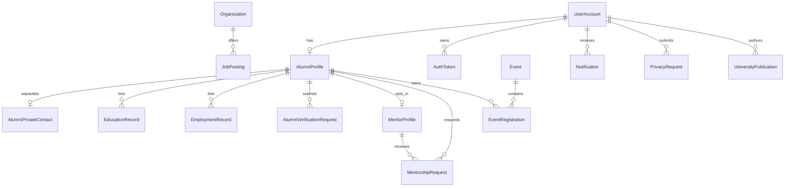

# Database design and migration strategy

Status: V0001 technical schema remains unchanged. M1B adds [V0002 identity/security audit](../backend/src/main/resources/db/migration/V0002__identity_and_security_audit.sql) and [V0003 JDBC sessions](../backend/src/main/resources/db/migration/V0003__jdbc_sessions.sql). M2A adds V0004 and the six owner-profile tables documented below, alongside user_accounts, audit_events, spring_session, spring_session_attributes and Flyway history. The entity inventory below is the broader conceptual target; tables outside the M1/M2A implemented inventories are not implemented. See [M1B security](m1b-security.md) for exact columns, constraints, session compatibility and runtime-role deployment prerequisites.

## Modeling conventions

- One application schema, proposed name `mezun360`; module ownership is enforced in code and review. No cross-module repository access. Runtime credentials have no DDL privileges.
- Use UUID identifiers for domain entities, `timestamptz` for instants, `date` for calendar-only values and explicit IANA timezone fields for event display. PostgreSQL stores instants; the API returns ISO 8601 UTC timestamps. Graduation year is a bounded integer, not a timestamp.
- Every mutable domain aggregate has `created_at`, `updated_at` and an optimistic `version`. Associate actors when needed. Do not use a universal soft-delete flag: each domain has explicit archival/deactivation and retention rules.
- Persist stable enum strings with check constraints rather than enum ordinals. Constraints and enum expansions use Flyway. Length and nullability constraints mirror the API; JSONB is for versioned technical envelopes/allowlisted metadata, not core relational business data.
- Use foreign keys, unique constraints and supporting indexes. Document delete behavior explicitly. Default to restrictive deletes on business history; purge/anonymize through a privacy workflow after the approved retention period.
- Canonical email uniqueness uses a deterministic normalization policy shared by login/registration/reset. Preserve original display spelling; use locale-independent normalization, do not remove dots or `+` tags. Confirm internationalized email support before implementation.

## Main entities

| Owner | Entity / proposed table | Essential data and constraints |
| --- | --- | --- |
| identity | `UserAccount` / `user_accounts` | ID, canonical/display email, role, status, email verified time, password hash when local auth, credential/security version, last login; unique canonical email; role check allows only `ALUMNI` and `ADMIN` |
| identity | `AuthToken` / `auth_tokens` | Account FK, purpose (`VERIFY_EMAIL`, `RESET_PASSWORD`), token digest, expires/consumed times; unique digest, purpose-bound consumption; no plaintext token |
| identity | `MfaFactor` / `mfa_factors` | Account FK, method/reference, enrollment/verification/revocation times; encrypt factor secrets when required by the maintained MFA implementation; no factor material in API DTOs |
| identity | `MfaRecoveryCode` / `mfa_recovery_codes` | Account/factor reference, code digest and consumed time; single-use atomic consumption; recovery never grants a role or permanent MFA bypass |
| identity | Spring Session tables | Library-version-specific session and attribute tables, expiry and principal indexes; schema installed by Flyway only; principal uses stable account ID |
| alumni | `AlumniProfile` / `alumni_profiles` | Unique account FK and professional fields; M2B adds evidence revision. Privacy is a separate one-to-one row and effective verification is derived, as detailed in the implemented M2B section below. Employer preference remains future-only. |
| alumni | `AlumniPrivateContact` / `alumni_private_contacts` | Unique profile FK, optional phone and private contact email; restricted service access; login email remains identity-owned |
| alumni | `Department` / `departments` | Stable code, name, active flag; university-approved reference records; referenced records retained if inactive |
| alumni | `EducationRecord` / `education_records` | Profile FK, department FK, degree level, graduation year; validation of plausible values; multiple degrees allowed |
| alumni | `EmploymentRecord` / `employment_records` | Profile FK, organization display name, title, start/end dates, current flag; end cannot precede start; professional history only |
| alumni | `AlumniVerificationRequest` / `alumni_verification_requests` | Profile FK, `PENDING`/`VERIFIED`/`REJECTED`, submitted evidence snapshot, submission/decision times, ADMIN reviewer, safe source/reference and private reason; one effective pending request per profile/evidence revision; reviewed evidence immutable; no OBS data fetch in MVP |
| careers | `Organization` / `organizations` | Name, website and descriptive data supplied by staff; no login, membership or employer authority |
| careers | `JobPosting` / `job_postings` | Organization FK, title/description/location/work mode, lifecycle status, `application_mode` (`EXTERNAL_APPLICATION`/`INTERNAL_APPLICATION`), conditional `external_application_url`, published/closing times and actors; member-only access; MVP service only enables external mode |
| careers | `SavedJob` / `saved_jobs` | Profile and job FKs; unique pair; private to owner |
| mentoring | `MentorProfile` / `mentor_profiles` | Unique alumni profile FK, expertise, capacity, opt-in flag, moderation status, availability; discoverable only when opted in, approved, active and eligible |
| mentoring | `MentorshipRequest` / `mentorship_requests` | Mentor/mentee FKs, topic, message, preferred meeting method/time, resolved preference-window instants/timezone, session type/duration, canonical status, requested/decision/completed/cancelled times, actor/reason; accepted request is the match, no separate quick-session table |
| events | `Event` / `events` | Title/description/organizer/location, start/end instants, timezone, optional registration/cancellation cutoffs, capacity, status, publication time; member-only; end > start, cutoff no later than start, capacity > 0 when bounded |
| events | `EventRegistration` / `event_registrations` | Event and profile FKs, participation status, registered/cancelled times, attendance marking actor/time; unique event/profile pair |
| content | `UniversityPublication` / `university_publications` | Kind (`ANNOUNCEMENT`/`NEWS`), title, sanitized body, approved source URL/reference, lifecycle status, audience (`MEMBERS` default / `PUBLIC` selected by staff), publication time and actors; no member-data embedding |
| notifications | `Notification` / `notifications` | Recipient account FK, type/template version, safe parameters or entity reference, created/read timestamps, dedup key; unique recipient/event/type |
| notifications | `NotificationPreference` / `notification_preferences` | Account FK, category, channel, enabled, updated time; unique account/category/channel; security/service rules may override optionality |
| notifications | `NotificationDelivery` / `notification_deliveries` | Notification/event and recipient references, channel, status, provider ID, attempts, next attempt, dedup key; no full email body or raw contact address in operational logs |
| notifications | `SecretDeliveryEnvelope` / `secret_delivery_envelopes` | Token-delivery reference, ciphertext, key version, expiry; encrypted short-lived reset/verification-link material only; purged on terminal delivery/expiry |
| automation | `OutboxEvent` / `outbox_events` | Event ID/type/schema version, aggregate ID/version, minimal JSONB payload, correlation/occurred time, status, attempts, next attempt, lease owner/expiry, processed time |
| automation | `ScheduledJob` / `scheduled_jobs` | Job type, entity/recipient references, schedule version, run time, dedup key, state, attempts, lease; durable reminders and approved maintenance jobs |
| audit | `AuditEvent` / `audit_events` | Actor pseudonymous ID/type and role snapshot, action, target ID/type, outcome/reason, time, correlation ID, allowlisted changed field names; append-only runtime access |
| privacy | `PrivacyRequest` / `privacy_requests` | Requester account FK, kind, status, submitted/completed times, assignee, restricted notes and completion reference; no export payload stored in general notes |
| privacy | `PrivacyPreferenceRecord` / `privacy_preference_records` | Account FK, purpose/preference or notice type, notice/version, choice and timestamp; distinguish required notice acknowledgment from optional consent |

MFA storage above is a conceptual local-security boundary; TOTP is intended; choose and implement the real library in separately authorized production security work. Future SSO account-link records would bind unique `(provider, issuer, subject)` to a stable account; no SSO, e-Devlet or OBS integration tables are created for MVP. No employer membership, CV/upload or active waitlist tables are planned.

Future-only `JobApplication` remains a careers-domain concept: job/profile FKs, submission, optional note, internal review state and unique job/profile pair. Its table, workflow, API and metrics are deferred. Both job application modes are modeled now; only external mode is enabled. Internal mode must not be published through MVP services.

An external job requires a validated HTTPS URL; reject credentials, unsafe schemes, control characters and unapproved/local/internal destinations. Future internal mode has no external URL. Enforce the mode/URL shape in DTO validation, service checks and database constraints when migrated. Application mode is independent of job lifecycle and publication is not permission for anonymous access.

Mentorship fields: nonblank `topic` and `message`; `preferredMeetingMethod` is `VIDEO`, `PHONE` or `IN_PERSON`; `preferredTime` follows the reviewed Figma choices `THIS_WEEK`, `NEXT_WEEK`, `WITHIN_TWO_WEEKS`. On submission the service resolves that preference into a bounded time window in `Europe/Istanbul` and stores UTC bounds so the meaning does not drift. It is a preference, not a reservation. `sessionType` is `STANDARD` or `QUICK`; quick uses the design's configurable 20-minute default. Detailed contact data is not stored in the request or exposed by choosing PHONE. Scheduling/contact-exchange details beyond these preferences require an explicit protected workflow and are not implemented by a successful request toast.

## Key relationships

Administrators need no alumni profile. Service checks enforce that participant records belong to eligible alumni. Profile ownership does not change through ordinary API updates. Foreign keys enforce existence; services enforce role, eligibility and cross-table workflow rules.

## State transitions

| Aggregate | Allowed transitions and restrictions |
| --- | --- |
| Account | `PENDING_EMAIL → ACTIVE` after verification; active accounts may be suspended/deactivated through authorized workflows; staff reactivation requires a reason and prior verification checks; deactivated-account restoration is policy-controlled |
| Alumni verification | Initial `PENDING`; submitted `PENDING → VERIFIED/REJECTED` by an authorized ADMIN; resubmission `REJECTED → PENDING`; audited revocation/material evidence change `VERIFIED → PENDING` with a new review and immediate member-access invalidation |
| Job | `DRAFT → PUBLISHED → CLOSED → ARCHIVED`; draft may archive directly; published jobs may be edited with a version check; no reopening/republication in baseline |
| Mentor profile | `DRAFT → PENDING_REVIEW → APPROVED/REJECTED`; rejected may resubmit; approved may pause and resume with staff approval rules; opt-out immediately hides discovery and blocks new requests |
| Mentorship | `REQUESTED → ACCEPTED/REJECTED` by the receiving mentor; `REQUESTED → CANCELLED` by the requester; `ACCEPTED → CANCELLED/COMPLETED` by either participant with appropriate reason/confirmation; staff may cancel with an audited reason; terminal states do not reopen |
| Event | `DRAFT → PUBLISHED → COMPLETED`; published may become `CANCELLED`; completion occurs through an idempotent due-state job after end time; cancellation is terminal |
| Registration | `REGISTERED → CANCELLED`; re-registration reuses the same row and rechecks capacity/cutoffs; event cancellation cancels remaining registrations once; attendance (`UNMARKED`, `ATTENDED`, `NO_SHOW`) is a separate staff-marked field |
| Privacy request | `SUBMITTED → IN_REVIEW → COMPLETED/REJECTED`; reasons recorded; fulfillment and identity checking require the approved policy |
| University publication | `DRAFT → PUBLISHED → ARCHIVED`; draft may archive directly; only staff select PUBLIC; public reads require both published state and public audience |

Alumni status is exactly the three states above; request existence/submission time distinguishes not-yet-submitted onboarding while the profile stays `PENDING`. Material verified-education edits return the current revision to unsubmitted PENDING and remove eligibility; explicit resubmission creates the new review, followed by ADMIN approval before VERIFIED is restored. Biography edits do not. Mentor-profile moderation uses its own existing review states and must not be confused with alumni verification or mentorship-request status. Material mentor expertise/description changes need re-review; capacity changes cannot invalidate existing accepted sessions. After account suspension, hide discovery, block new actions, suppress reminders and flag existing commitments for staff resolution without rewriting outcomes or disclosing the reason to peers.

## Constraints and concurrent operations

- Add unique constraints for canonical email, one profile per account, job/bookmark pair, event/registration pair and notification deduplication. Partial unique indexes enforce one submitted `PENDING` verification per profile/evidence revision and one mentorship per pair in `REQUESTED` or `ACCEPTED`, across both session types. Cross-table self-mentorship checks remain in the service. Future internal applications add their unique pair constraint through Flyway when authorized.
- Event registration locks the event row, validates current status/deadline and eligible actor, then counts current registered rows and inserts/reactivates in the same transaction. Cancellation and staff capacity changes take the same event lock. Capacity cannot be reduced below registered count. Unique pair constraints prevent duplicate seats on retries.
- External application handoff resolves the stored destination after account, verification, publication, mode and deadline checks. It creates no application row and cannot guarantee a third-party site accepts applications. Future internal submission/closure will share a job lock and unique pair invariant; that transactional workflow is not part of MVP.
- Mentor acceptance locks the mentor profile and request, rechecks both users' eligibility and the count of `ACCEPTED` sessions, then changes state. Both session types consume the same capacity; bound `REQUESTED` work through validation/rate limits. Reject acceptance after opt-out, cancellation or capacity exhaustion.
- MVP full events reject registration with `EVENT_FULL`. A future waitlist policy would reuse the event-lock/eligibility/outbox boundary; no `WAITLISTED` state, queue row or promotion logic exists in MVP. Attendance remains independent from cancellation and capacity.
- Use a documented consistent lock order: account rows sorted by ID → eligibility/profile rows sorted by ID → business aggregate → child workflow row. Eligibility mutations use the same account/profile locks as participation commands. Transactions stay short; no provider calls while locks are held. Retry recognized deadlocks only with bounded, safe/idempotent service operations.
- Use optimistic versions for ordinary edits and return API `412` for stale `If-Match`; domain/uniqueness conflicts use `409`. Validation races must be handled from database exceptions without leaking SQL or constraint names.
- Read-committed isolation is the proposed default with these explicit locks. Prove concurrency rules with real PostgreSQL Testcontainers tests; add stronger isolation only for a demonstrated invariant.

## Queries, indexes and metrics

Index actual query patterns and frequently joined foreign keys: job `(status, application_mode, published_at, id)`, event `(status, starts_at, id)`, registration `(event_id, status)`, directory `(profile_visibility, verification_status, id)`, publication `(status, audience, published_at, id)`, notification `(recipient_id, read_at, created_at, id)`, audit `(occurred_at, id)` plus approved actor/target lookups. Outbox/jobs need due-work and expired-lease indexes. Internal application indexes are deferred with that table. Validate plans against representative data; avoid speculative indexes on every field.

Reporting owns definitions and returns `asOf`, requested period, effective filters and timezone. Initial metric proposals:

| Metric | Definition/source |
| --- | --- |
| Verified active alumni | Distinct `ALUMNI` accounts that are active, email verified and have profile verification `VERIFIED` at `asOf` |
| Open jobs | Published external-mode jobs with no closing time or closing time after `asOf`; authorized member/staff query |
| Internal applications submitted | Future only; unavailable/omitted in MVP, never represented by outbound clicks or an invented zero |
| Upcoming events | Published events starting after `asOf`; cancelled/completed excluded |
| Event registrations | Current `REGISTERED` rows for the selected event set; separate from historical registration volume and attendance |
| Active mentorships | Requests in `ACCEPTED`; distinct request count across STANDARD/QUICK, not mentor-profile count |

Personal metrics additionally filter by actor. All analytics require authentication/authorization. Use server aggregates, not private row downloads. Keep demographic breakdowns disabled until BTÜ sets the configurable disclosure threshold/filters; suppress small/coincident cohorts under that policy, never rendering suppression as zero. Live indexed queries are sufficient initially. No synthetic production seed counts. Outbound clicks, if an authorized measurement is later added, must be labeled as navigation and never as completed applications.

## Flyway strategy

1. Put ordered versioned SQL in `backend/src/main/resources/db/migration/`. Use `V0001__descriptive_name.sql`, increasing versions allocated during review. Applied migrations are immutable; corrections use a new migration. Flyway validates checksums. See [versioned migration documentation](https://documentation.red-gate.com/flyway/flyway-concepts/migrations/versioned-migrations).
2. Every schema/table/index/constraint change and shared reference-data change uses Flyway. Applied sequence: identity/minimal audit and sessions. Future sequence: MFA and notification/outbox foundations as authorized; alumni/reference/verification; external careers; mentoring/events; notifications/content/privacy/reporting as each authorized milestone needs them. Do not precreate internal application, SSO, OBS, employer or waitlist tables. The M1A schema has no persisted verification/mentorship states to migrate; any later stored-state change still requires a forward Flyway migration.
3. Set Hibernate to schema validation, not `create`, `create-drop` or `update`. Disable SQL initialization and Spring Session automatic initialization. Testcontainers also runs the actual Flyway path; test migrations must not mask production-schema gaps.
4. Use a single deployment migrator with a DDL-capable identity; application replicas use a restricted runtime identity. Local development may run Flyway at startup with explicitly local credentials. A failed migration stops rollout; never automatically baseline an unknown database or call `repair` without investigating.
5. Test a clean database and an upgrade from the previous released schema with synthetic representative data. Verify constraints, non-null/default assumptions, index/query effects and compatibility with the still-running old application during deployment.
6. Use expand → backfill → switch reads/writes → contract across releases. Large backfills are bounded, restartable and checkpointed. Database structure enabling a backfill still uses Flyway. Plan explicit transaction handling for operations such as concurrent index creation; test their failure recovery.
7. Back up and rehearse restore before destructive changes. Prefer a forward corrective migration; application rollback is safe only while schema remains compatible. Restoration is an incident operation that may lose subsequent writes, not a normal rollback button.
8. Demo/test data is separate from production migration locations. Production seeds contain only approved reference data, never accounts with default passwords or invented metrics. Normal audited business changes to user records are service operations, not new migrations per record.

## Retention and privacy lifecycle

For each category—account/profile/contact data, verification evidence, registrations, mentorship messages, publications, notifications, audit, outbox/jobs, privacy requests, backups and future applications—the retention duration is:

> TBD – to be defined by Bursa Technical University according to institutional policy and applicable KVKK requirements.

Model future retention policy by category, policy version, effective date, configured duration/trigger, permitted action and institutional hold/exemption. It may be configuration-backed initially and persisted later if operationally needed; persisted schema changes use Flyway. No legal duration belongs in controller/service constants or migration defaults. Unset policy is explicit and disables automatic age-based deletion for that category; report policy gaps to the responsible operator. Verified individual privacy requests follow approved policy and are not an excuse to run blanket deletion.

Technical session/token/MFA-challenge expiry, worker leases and delivery-secret TTL are separate configurable security controls, not legal retention durations. Expired credentials stop authenticating immediately regardless of later cleanup. Secret delivery envelopes expire independently and are removed after terminal delivery/expiry under the security design. BTÜ defines any additional audit/evidence retention; do not infer it from token lifetime.

A verified deletion request orchestrates each module: revoke sessions/tokens; remove directory/mentor discovery; delete or anonymize contact and professional data according to policy; reconcile active commitments; remove queued optional notifications; anonymize required historical reporting. No blanket `ON DELETE CASCADE` across audit or business history. Audit actor/target identifiers are pseudonymous references without cascading user FKs; never store contact values in audit history.

Separate deletion of identifying attributes from approved preservation of transactional evidence. Maintenance uses a narrowly authorized identity and writes an audit record of the processing action without reproducing removed data. Backups and replicas must have documented expiry and restore-time deletion reconciliation. Export bundles, if approved, are private, short-lived and delivered only to a reverified requester; there is no public export URL or general bulk-alumni export in MVP.

## Implemented M2A schema

[V0004](../backend/src/main/resources/db/migration/V0004__owner_alumni_profile.sql) adds six tables. V0001–V0003 are unchanged. Hibernate remains `validate`; migration history owns DDL. No fixture, visibility preference, verification workflow or institutional reference data is seeded.

| Table | Implemented responsibility |
| --- | --- |
| `alumni_profiles` | UUID PK, unique/restrictive `user_id` FK to identity; required first/last names, optional department/year/city/company/position/industry/about; four default-false contribution booleans; timestamps and optimistic version |
| `employment_records` | Profile FK, company/position, optional industry/city/description, start/end dates, current flag, timestamps; uses the established employment name for CareerExperience |
| `education_records` | Profile FK, institution/department/degree, start/graduation years, timestamps; server-owned `source=USER_ENTERED`, never proof of verification |
| `skills` | Reusable UUID, display and unique normalized names, timestamps; NFKC + whitespace collapse + Locale.ROOT lowercase normalization |
| `alumni_profile_skills` | Composite profile/skill PK and FKs; normalized duplicate skills within a submitted profile are rejected |
| `certifications` | Profile FK, name/issuer/year, optional HTTPS credential URL, timestamps; no file data |

Contribution preferences belong to the profile aggregate, so no redundant one-to-one preference table is created. UserAccount remains authentication-only. Only an active authenticated ALUMNI can create/update a profile through the service; ADMIN is denied. Profile creation is explicit on first valid PUT; GET does not write.

Child profile FKs cascade only if a profile is deliberately removed by a future authorized privacy operation. Owner account FK is RESTRICT. Removing an own user-entered child through profile editing uses orphan removal; shared skills survive and cannot be deleted while referenced. Child indexes begin with profile ID and chronological date/year; the skill reverse index supports FK checks. The join has no independent timestamps/version because it is aggregate membership; its changes advance the profile version and audit entry.

The aggregate is bounded to 30 employment, 20 education, 50 skills and 30 certification records. Maximum names/positions/institutions are 100/150 as specified in the contract; about/description 2,000; skill 60; URL 2,048 characters. Years start at 1900, with a service upper bound of current UTC year + 1 for profile/education and current year for certifications. Employment dates run from 1900 through today; a finished record requires end >= start, and a current record has no end. These are engineering validation limits, not institutional graduation eligibility or retention policy.

Profile writes take a transaction-scoped PostgreSQL advisory lock keyed by the authenticated owner, including initial creation, then compare the strong ETag and use JPA optimistic versioning. Hash collisions can only serialize unrelated writes. Shared skill inserts use a sorted, conflict-safe unique-key upsert. DTO mapping happens inside the transaction with OSIV disabled. No notification/outbox consumer is authorized in this slice; minimal `PROFILE_UPDATED` audit commits atomically with the profile, recording actor/target/correlation IDs without field values.

Upgrade is additive and requires no backfill: existing accounts retain zero profiles. Tests apply M1 through V0003 in a separate PostgreSQL database, retain an identity record through V0004, validate checksums and repeat migration with zero new work. Roll back application code only while keeping the additive schema/data; do not run a destructive down migration. Corrections after application use a new Flyway version. Backup/restore remains an operational release responsibility.

M2B adds opt-in visibility and manual verification using the forward migrations and separate commands below. Any institutionally sourced education must be protected from owner replacement before enabling that source; only USER_ENTERED is currently permitted by the database. No directory or verification status is implemented by this migration.

## Implemented M2B storage and lifecycle

[V0005](../backend/src/main/resources/db/migration/V0005__alumni_privacy_verification.sql) adds two tables and `alumni_profiles.evidence_revision` (nonnegative bigint, default 0). [V0006](../backend/src/main/resources/db/migration/V0006__verification_reason_constraint.sql) strengthens the rejection-reason non-null invariant: PostgreSQL CHECK alone permits UNKNOWN. V0001–V0004 remain unchanged; V0005 was also already applied locally and is preserved.

| Storage | Invariants |
| --- | --- |
| `alumni_privacy_settings` | Profile UUID PK/FK, `directory_opt_in=false`, `profile_visibility=PRIVATE` constrained to PRIVATE/ALUMNI_MEMBERS, timestamps and optimistic version. Existing profiles are backfilled private; first profile creation inserts the same defaults in its transaction. Profile FK cascades only through a future authorized deletion. |
| `alumni_verification_requests` | UUID, restrictive profile/reviewer FKs, evidence revision, bounded allowlisted JSONB snapshot, status PENDING/VERIFIED/REJECTED, `source=MANUAL_ADMIN`, submission/review/created/updated timestamps, reviewedBy, safe rejection reason and optimistic version. No internal note, document, contact data or external reference is stored. |
| `alumni_profiles.evidence_revision` | Advances on first/last name, department, graduation year or substantive education-record changes. Snapshot comparison ignores record ordering/IDs and whitespace normalization; career, city, skills, biography, certificates and contribution flags do not invalidate approval. |

Effective verification is the latest submitted request for the profile's current evidence revision. With none, it is PENDING with `submitted=false` and null timestamps/reason. This avoids a second mutable copy of verification status on the profile. A rejected request remains immutable; explicit resubmission creates a new PENDING record. A partial unique index prevents duplicate PENDING submissions within one revision. Older revisions may retain their historical PENDING label, but are excluded from the actionable queue and cannot grant access or receive a decision. They are evidence history, not additional active requests.

Submission snapshots all current bounded education records plus first/last name, department and graduation year. It requires department/year and at least one completed education record; this is data completeness, not invented institutional proof criteria. All education remains USER_ENTERED. ADMIN approval verifies the submitted alumni claim; it does not relabel every education record as an institutional import. The service enforces reviewer authority, no self-review, target eligibility, current revision and exact ETag. PENDING can become VERIFIED or REJECTED once. Rejection requires trimmed 10–500 character single-line plain text; VERIFIED cannot carry a rejection reason. A trigger forbids changing evidence/submission identifiers or any completed decision. Review timestamp/reviewer/state constraints and forward reason constraint add DB protection.

Indexes support profile/revision history, status/time/id queues and reviewer FK lookups. No production identities or metrics are seeded. Audit reuses the existing table; no audit schema expansion. M2C discovery must require directory opt-in AND ALUMNI_MEMBERS AND effective VERIFIED plus current account eligibility, and omit contacts. Employer visibility is not persisted until its future feature is authorized; absence grants no access.

Upgrade verification covers fresh PostgreSQL, M1 → current, M2A populated profile → current, private backfill, checksum validation and idempotent repeated migration. Hibernate remains validate. Deployment rollback is forward-fix; restore an approved backup only through an operator plan, never edit applied migrations or drop review history. The immutable-history guard will need a separately authorized policy migration for a future retention/anonymization workflow. Retention remains the institutional TBD stated above, with no automatic deletion.
